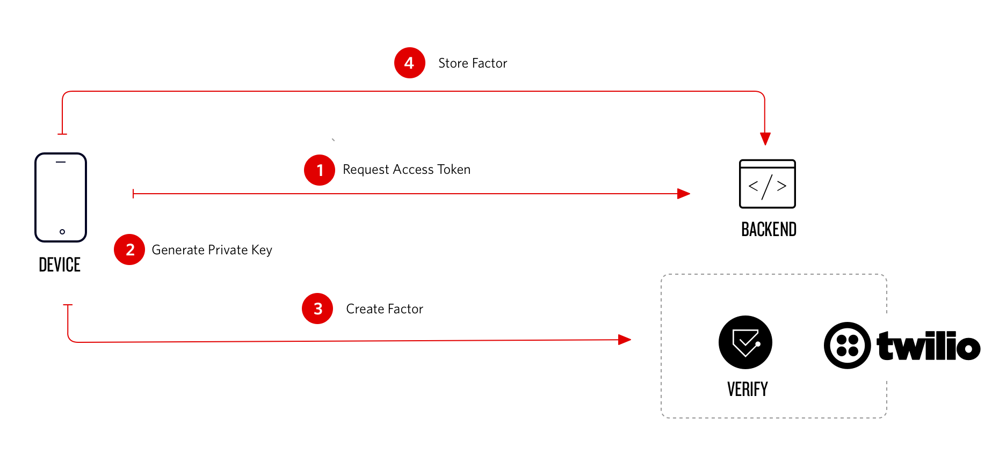

# Twilio Verify Push Website Login

Twilio Verify Push is a multi-factor authentication method that requires the user to approve a transaction with an mobile application. This project demonstrates how to secure a login on a website. The user is granted access to the page after the sign up was approved with the app which has the Android or iOS Verify SDK embedded.

Twilio Verify Push SDK helps you adding multi-factor sdcurity with a low-friction and secure setup. This fully managed API service allows you to seamlessly verify users in-app via a secure channel.

This repository contains the website and the server backend written in NodeJS. For the mobile application please checkout the [Android Quickstart](https://github.com/twilio/twilio-verify-android) and [iOS Quickstart](https://github.com/twilio/twilio-verify-ios).

## Device Registration



## Installation

Fork and clone the repository. Then, install dependencies with

`npm install`

To run the application, you'll need to gather your Twilio account credentials and configure them in a file named .env. To create this file from an example template, do the following in your Terminal.

`cp .env.sample .env`

Before you start the install, you’ll need to collect the following variables from the Twilio Account Portal.

`TWILIO_ACCOUNT_SID`
`TWILIO_AUTH_TOKEN`

### Configure the Verify Service

Create a (Notify Service)[https://www.twilio.com/docs/verify/quickstarts/push-android#configure-or-select-a-notify-service] for Push.
Configure a (Verify Service)[https://www.twilio.com/docs/verify/quickstarts/push-android#configure-a-verify-service]

To run this application you need to host it on a public domain. If a user approves a challenge the server is notified via (Verify Webhooks)[https://www.twilio.com/docs/verify/api/webhooks]. Please configure `http(s)://<your-domain>/api/challenges/update-webhook` as webhook url on the Verify Service. You can subscribe to multiple events on Verify, this example appliation requires at least the `challenge.approved` and `challenge.denied` event.

Add the `TWILIO_VERIFY_SERVICE_SID` to your environment variables

Start the application

`npm start`

Your application should now be running at **http://localhost:5000/**.

### Register a Local User

Access **http://localhost:5000/register** on your browser, you can now register a first user.

In the default setting no device is register as a factor, a user can sign up and access the profile page.

### Register a Mobile Application

This project requires a mobile app with the Verify SDK embedded that implements the following API calls.

**POST /api/login**

```json
{
  "name": "Bob",
  "password": "Builder"
}
```

**Response:**

Returns the session Cookie and the userId you later use to register the factor. The Cookie needs to be added to the susequental API calls.

```json
{
  "id": "e13cf2ec-5def-4652-b22b-6f1bca6b55ae"
}
```

**POST /api/devices/token**

**Response:**

```json
{
  "token": "...",
  "serviceSid": "VA....",
  "identity": "e13cf2ec-5def-4652-b22b-6f1bca6b55ae",
  "factorType": "push"
}
```

Returns a JSON object with the access token the Verify SDK will use to register the factor with Twilio.

**POST /api/devices/register**

```json
{
  "id": "e13cf2ec-5def-4652-b22b-6f1bca6b55ae",
  "sid": "YF...."
}
```

**Response:**

```json
{
  "done": true
}
```

Saves the created Factor on the website backend, if the factor is stored on the user a login request will promt the user on the mobile application to approve or denie the rquest. After the challenge is approved or denied, the website will automatically redirect.

# License

MIT
